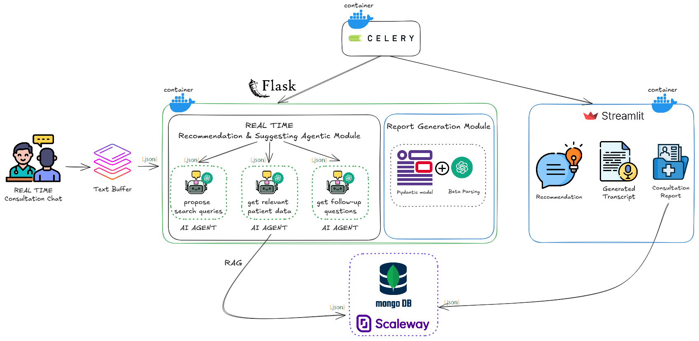

# ai_action_summit_hackathon_an2i

A comprehensive medical prescription analysis system that leverages AI to enhance patient care and medical decision-making.

## Our Approach

Our system implements a multi-faceted approach to medical analysis and prescription safety:

1. **Real-time Conversation Analysis**
   - Automated extraction of medical context from doctor-patient dialogues
   - Dynamic generation of relevant medical queries
   - Intelligent follow-up question suggestions

2. **Prescription Safety System**
   - Automated anomaly detection in prescriptions
   - Cross-referencing with patient medication history
   - Real-time alerts for potential drug interactions
   - Analysis of patient medication adherence patterns

3. **Comprehensive Reporting**
   - Side-by-side display of medical reports and prescription analysis
   - Detailed symptom and pathology documentation
   - Clear treatment plans with safety considerations
   - Intelligent summarization of medical findings



### Generated Reports

Access our sample medical reports and analysis:
- [Technical Report](reports/Tech_Report.pdf)
- [Business Plan](reports/Buisness_Plan.pdf)


## Flask API Service

The project includes a robust Flask API that provides various medical analysis endpoints:

### API Endpoints

- `/detect-prescription-anomalies` - Analyzes prescriptions for potential conflicts
- `/extract-ordonnance` - Extracts structured data from medical prescriptions
- `/summarize-ordonnances` - Generates summaries of multiple prescriptions
- `/search-medical-articles` - Searches for relevant medical literature
- `/fetch-article-abstract/{pmid}` - Retrieves abstracts of medical articles
- `/generate-search-summary` - Summarizes medical research findings
- `/generate-follow-up-questions` - Generates relevant follow-up questions
- `/extract-pertinent-points` - Extracts key medical points from conversations
- `/generate-search-propositions` - Suggests relevant medical search queries
- `/generate-report` - Generates comprehensive medical reports

The API runs on port 5000 by default and accepts JSON payloads for POST requests.

## Streamlit Dashboard

The project includes a user-friendly Streamlit dashboard that provides a graphical interface to interact with the API services. The dashboard offers:

### Features

- Interactive navigation sidebar for different functionalities
- Form-based input for medical data
- Real-time API response display
- Error handling and user feedback
- Medical article search interface with abstract viewing
- Report generation interface
- Prescription anomaly detection with visual alerts

### Dashboard Pages

1. Prescription Analysis
   - Anomaly detection
   - Ordonnance extraction
   - Prescription summarization

2. Medical Research
   - Article search with configurable results
   - Abstract viewing
   - Search summary generation

3. Medical Documentation
   - Follow-up question generation
   - Pertinent point extraction
   - Report generation

The Streamlit dashboard connects to the Flask API at `http://localhost:5000`.

# Development

## Notes
- commit messages should follow conventional commits spec: https://www.conventionalcommits.org/en/v1.0.0/ (see sections: Summary, Examples)
- work must be merged from feature branches into main branch using Pull Requests. Once your code is ready to be reviewed, please mark me as a reviewer, which will notify me you're ready fir code review 

## How-to's 

### Install 

1. install uv: https://docs.astral.sh/uv/getting-started/installation/#standalone-installer
2. run
   ```shell
   uv sync --all-extras --dev
   ```
3. Before running scripts add the current directory to the PythonPath:
```
export PYTHONPATH=/home/azzedine/Projects/ai_action_summit_hackathon_an2i:$PYTHONPATH
```

### Running the Services Locally

1. Start the Flask API:
```shell
python3 -m workspace.src.api
```

2. Start the Streamlit Dashboard:
```shell
streamlit run workspace/app/main.py
```

### Docker Deployment

The project can be run using Docker Compose, which sets up all required services automatically.

#### Prerequisites

1. Install Docker and Docker Compose on your system
2. Copy the environment variables file:
   ```shell
   cp .env.example .env
   ```
3. Update the `.env` file with your credentials:
   - API_KEY: Your API key
   - PROVIDER_URL: Your provider URL
   - MongoDB credentials (if using MongoDB):
     - USERNAME_MONGODB
     - PASSWORD_MONGODB
     - INSTANCE_MONGODB
     - REGION_MONGODB
     - PATH_TLS_CERTIFICATE_MONGODB

#### Services

The Docker Compose setup includes the following services:

- **API Service** (Port 5000): Flask API server
- **Streamlit Dashboard** (Port 8501): Web interface
- **Redis** (Port 6379): Message broker for Celery
- **Celery Workers**:
  - LLM Worker: Handles language model tasks
  - API Worker: Handles API-related tasks
- **Flower** (Port 5555): Celery monitoring interface (credentials: admin/admin)

#### Running with Docker Compose

1. Build and start all services:
   ```shell
   docker compose up --build
   ```

2. Access the services:
   - Streamlit Dashboard: http://localhost:8501
   - Flask API: http://localhost:5000
   - Flower Dashboard: http://localhost:5555

3. Stop all services:
   ```shell
   docker compose down
   ```

### Lint (check & fix)
1. open a new terminal in the root of this repo and run:

```shell
uv run ruff check --fix
uv run ruff format
uv run mypy .
```

### Run tests 
1. open a new terminal in the root of this repo and run:
```shell
uv run pytest